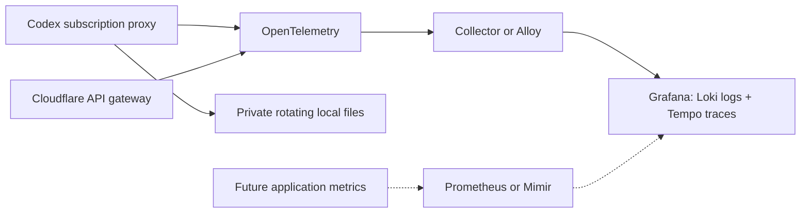

# Logs, traces and the recommended backend

Recommendation, researched 2026-09-17: instrument with OpenTelemetry and use
Grafana for operational investigation. Keep Cloudflare as the API gateway runtime.
The local subscription proxy remains on the user's machine.

The user selected Grafana on 2026-09-17. A
[conditional PostHog follow-up](POSTHOG-TRIGGER.md) is active for outcome analysis
or concrete routing experiments; traffic volume alone does not trigger it.

| Component | Recommended role | Basis |
|---|---|---|
| OpenTelemetry SDK + Collector/Alloy | Instrumentation, trace propagation, batching and export | Common protocol across the local proxy and Worker; Collector handles delivery policy |
| Grafana Cloud, or self-hosted Grafana/Loki/Tempo | Search logs, explore traces and correlate signals | [Grafana supports logs, traces, metrics and OTLP ingestion](https://grafana.com/docs/grafana-cloud/observe-and-act/send-data/) |
| Prometheus/Mimir | Numeric time series and alerts, when metrics are added | [Prometheus stores metrics](https://prometheus.io/docs/introduction/overview/); it does not replace a log or trace store |
| Cloudflare Observability | Worker platform logs/traces and optional export | [Native OTLP export](https://developers.cloudflare.com/workers/observability/exporting-opentelemetry-data/) supports logs and traces; metrics export remains unavailable in the inspected documentation |
| Supabase | Application records/control-plane data if that product layer is built | [Supabase observability](https://supabase.com/docs/guides/observability) covers its project logs, drains, database metrics and tracing. Our design does not use Postgres as a raw span store |
| PostHog | Alternative combined product analytics and observability backend | [OTLP-native logs](https://posthog.com/docs/logs), [general distributed tracing in beta](https://posthog.com/docs/distributed-tracing), and [AI observability](https://posthog.com/docs/ai-observability) are available |

These are roles, not a requirement to deploy six services. Grafana Cloud reduces
backend operations; self-hosting gives storage control with additional maintenance.
No hosted account, plan, destination or paid deployment was created here.

The [Grafana versus PostHog assessment](GRAFANA-VS-POSTHOG.md) compares concrete
cache investigations, routing experiments, ingestion paths, privacy and cost.
Grafana also offers Agent Observability with generation tracking and evaluations;
our generic OTLP export does not automatically enable that product. PostHog's
AI-specific trace endpoint and its beta general tracing backend are separate;
the AI endpoint's span filtering is not a limit on all PostHog tracing.



## Implemented capture

The official OpenTelemetry JavaScript trace/log SDKs and OTLP JSON serializers
produce the records. Instrumentation is explicit; HTTP auto-instrumentation and
prompt capture are not enabled. Each inference request has a server span and one
client span per upstream attempt. One completion log carries the request's trace
and span IDs. Subscription model discovery and compaction are captured too.

Recorded fields include approved route/candidate/model metadata, status,
duration, attempt counts, cache outcome/affinity, known token usage and reported
cache reads/writes. `x-organized-trace-id` links a response to its trace. Cache
receipts include trace/span IDs. Valid W3C `traceparent` is continued and child
context is sent upstream; arbitrary incoming baggage is not recorded.

Worker instrumentation starts inside the authorized inference path. Platform
invocations, rejected API credentials, control endpoints and infrastructure
events need Cloudflare's native observability if required. The subscription proxy
also records its authentication rejections, using a fixed route label instead of
an arbitrary URL. Health, cache-stat and live-usage polling are excluded.

The [live usage monitor](LIVE-USAGE.md) also emits changed daily totals as
`organized.usage.snapshot` logs. They carry numeric aggregates and a local date,
with no inference spans or session identifiers. These are snapshots, so use the
latest value rather than summing them. Subscription-limit snapshots stay local.

The attribute allowlist excludes prompt/output text, tools, request/response
bodies, authorization, API keys, account IDs, raw session/cache keys and URLs or
query strings. Errors use bounded categories, not upstream bodies or exception
messages. Exact-cache hits record zero new inference tokens. Sum request spans
or completion logs, not both request and child spans, to avoid double counting.
Missing usage remains unknown. None of these observations proves subscription
quota savings or billing savings.

## Use it locally now

The subscription service writes OTLP JSON batches to:

- `.local/telemetry/logs.jsonl`
- `.local/telemetry/traces.jsonl`

Each has one rotated `.1` file. Rotation occurs at approximately 5 MiB, keeping
about 20 MiB plus one bounded batch across both signals. Files are owner-only,
gitignored and survive router restarts. This bounded retention is a local
debugging buffer, not an archive or a retry queue.

```sh
npm run telemetry:status
npm run telemetry:status -- YOUR_32_CHARACTER_TRACE_ID
npm run router:status                 # Includes telemetry export-health counters.
```

The API Worker emits OTLP JSON envelopes to its console by default. For hosted
Workers, enable Workers Logs if console persistence is wanted. An OTLP trace
envelope printed as a console log is not automatically a native Cloudflare trace.
Set `OTEL_CAPTURE_CONSOLE=false` when sending directly to a collector if duplicate
console storage is unnecessary.

## Connect a destination

For a direct Grafana Cloud connection, create a Cloud access policy scoped to
your stack with only `logs:write` and `traces:write`, then add an expiring token.
Copy the endpoint and instance ID from the **OpenTelemetry** card in your Grafana
Cloud portal; that instance ID is not necessarily the Grafana stack ID.
[Grafana's credential and OTLP instructions](https://grafana.com/docs/grafana-cloud/observe-and-act/agent-observability/get-started/grafana-cloud/#collect-credentials-from-grafana-cloud)
describe these values. Agent Observability activation is not required for this
router's generic logs and traces.

Run this in a terminal on the machine hosting the router:

```sh
npm run telemetry:configure -- --restart
```

The command prompts for the endpoint, instance ID and a hidden token. It checks
both OTLP signal endpoints with empty batches before atomically saving the
gitignored `.local/telemetry.json` with owner-only permissions. A failed check
preserves previous settings. It refuses redirects and destinations outside
Grafana Cloud's HTTPS OTLP gateway. For automation, `--token-stdin` accepts private
input with explicit `--endpoint` and `--instance`; never place the token in shell
arguments, shell history or chat. `--restart` uses the installed service's idle
guard. Successful empty-batch checks verify access, not actual hosted ingestion:
confirm a subsequent router completion in both Loki and Tempo before claiming
the connection is complete.

The existing stack can be queried through `gcx`, but its experimental Cloud OAuth
exchange returned HTTP 404 and the access-policy plugin proxy denied credential
provisioning with HTTP 403 during setup. The user subsequently created the scoped
policy and token in their signed-in browser. Hosted export remains pending private
credential entry on the router host; no hosted dashboard has been created.

Both runtimes support the same configuration keys:

| Key | Meaning |
|---|---|
| `OTEL_EXPORTER_OTLP_ENDPOINT` | Collector/base URL; `/v1/logs` and `/v1/traces` are appended |
| `OTEL_EXPORTER_OTLP_HEADERS` | Comma-separated, percent-encoded `key=value` collector credentials |
| `OTEL_EXPORTER_OTLP_PROTOCOL` | `http/json` (the implemented transport) |
| `OTEL_TRACES_SAMPLER_ARG` | Root trace sampling ratio, 0–1; default 1; remote parent decisions respected |

Completion logs are retained independently of trace sampling. The local proxy
loads these keys from environment variables or private `.local/telemetry.json`;
environment values win. The service's launchd job does not inherit shell exports,
so use that file for its persistent settings, protect it with mode `0600`, then
restart the idle service. The [local settings example](../CONFIG/telemetry.local.example.json)
assumes a collector already listening on loopback port 4318.

For the Worker, add endpoint settings as environment bindings and keep exporter
authentication in Wrangler secrets. HTTPS is required outside loopback. Export
redirects are refused so collector credentials are never followed to another
host. Do not put credentials in URLs or checked-in configuration.

The [Collector Contrib template](../CONFIG/otel-collector.example.yaml) routes both
signals to Grafana and includes a memory limiter, bounded batches, retries and a
disk-backed queue. Supply `GRAFANA_OTLP_ENDPOINT`, `GRAFANA_OTLP_AUTH` and
`OTEL_QUEUE_DIRECTORY`, then validate it with the installed Collector before
deployment. It is a prepared template, not an installed or verified hosted service.
The Grafana portal supplies the actual regional endpoint and credentials. A
collector can route logs and traces to different backends if desired.

Cloudflare also offers managed OTLP destinations. Configure native exports for
platform telemetry separately from this SDK's application spans; do not export
the same signal twice. Check the current plan and persistence settings before
activation: native destination export has plan/beta restrictions and dashboard
storage can be billed separately. [Cloudflare setup and limits](https://developers.cloudflare.com/workers/observability/exporting-opentelemetry-data/)

## Delivery, sampling and verification

SDK queues hold at most 512 records per signal, exported in batches of at most 64.
Exports have a three-second timeout and do not block response streaming. Worker
`waitUntil` retains export work through completion; graceful proxy shutdown flushes
pending data. Failed exports increment counters while local capture continues.
Invalid exporter configuration disables remote export and surfaces
`configurationError`; it does not turn an inference request into a failure.
Partial-success rejections from an OTLP HTTP 200 are counted as failures.

App exports are best-effort, with no built-in durable retry. Abrupt termination,
full queues or exhausted storage can drop telemetry. Use Collector/Alloy delivery
queues and monitor exporter failures for hosted operation. Sampling all traffic is
appropriate for this initial local verification. At larger volume, choose a
retention/sampling policy and bounded dimensions; request IDs belong in trace/log
fields, not metric labels. Keeping every error trace while sampling successes
would require a collector tail-sampling policy and is not enabled here.

Run `npm run test:telemetry` for correlation, privacy, export, partial rejection,
collector outages, rotation and slow-collector streaming tests. The real Worker
suite additionally reconciles OTLP request/attempt spans and logs with actual
HTTP calls, cache hits and fallbacks. These use local OTLP HTTP receiver fixtures;
hosted Grafana ingestion is not claimed without destination credentials.

The live subscription/OTel probe is separately recorded in
[`subscription-telemetry-report.json`](../artifacts/subscription-telemetry-report.json).
It reconciles one real response across native CLI usage, router counters, one
completion log and two spans. The existing Grafana Cloud stack has been reached
through its CLI; hosted ingestion remains pending a usable ingestion credential.

Prometheus metrics, dashboards and alert rules are future work. Priorities are
request rate, errors, latency, cache-read ratio, exact reuse, fallback frequency and
telemetry drops. Logs and spans are not a substitute for an authoritative billing
ledger or a labeled quality dataset for modelrouter-style training.
