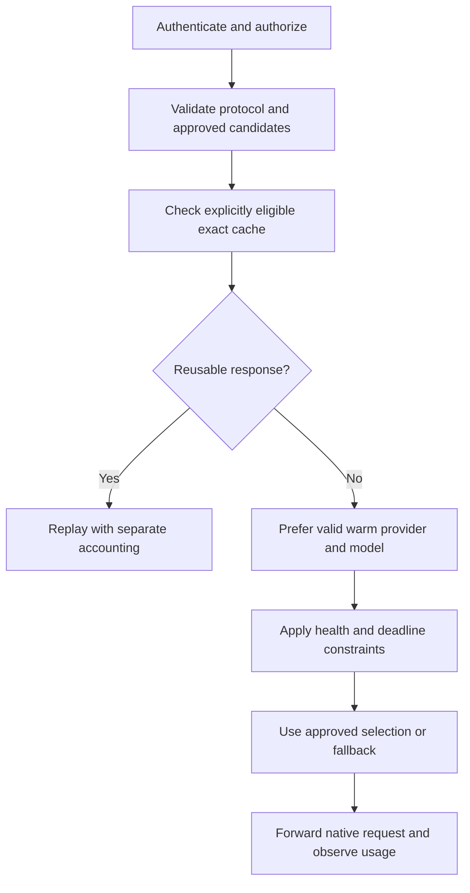

# Routing policy review

Reviewed 2026-09-17 in response to the two supplied references. This is a design
decision record; learned routing is not enabled by the current connector.

## What each reference contributes

| Reference | Decision it makes | Useful contribution to Organized Router |
|---|---|---|
| [Ramp engineering article](https://builders.ramp.com/post/thompson-sampling-model-routing) | Rank caller-approved model/provider/service-tier candidates using current reliability, latency and relative cost | Learn health and deadline risk; separate provider failures from invalid caller requests |
| [modelrouter](https://github.com/sachinkesiraju/modelrouter/tree/a8c3df60a543c894e510ed4f742e93b7fb774f74) | Predict which cheaper model can answer a prompt | Evaluate quality against a fixed baseline before allowing model substitutions |
| Organized Router today | Preserve the chosen subscription model; in API mode retain successful candidate affinity and use ordered fallback | Keep native requests intact and observe actual cache usage |

Ramp's July 20 article uses an exponentially weighted failure rate and a
Normal-Inverse-Gamma posterior over log latency. Thompson samples produce a
deadline-miss probability, combined with failure risk and relative cost to order
candidates. Redis stores pooled statistics. Caller preferences constrain the
candidate set. The article reports deployment experiments, but does not publish
enough scoring detail to reproduce its production policy exactly. Those results
are not evidence of savings on our traffic. The site's rendered article was
verified in its public compiled MDX asset, since the initial HTML contains only
metadata. [Article](https://builders.ramp.com/post/thompson-sampling-model-routing)

The inspected modelrouter commit is
`a8c3df60a543c894e510ed4f742e93b7fb774f74`, licensed Apache-2.0. Its
`FloorPolicy` chooses the cheapest candidate for which
`predicted_correctness * floor >= best_predicted_correctness`. This is a
relative prediction threshold, not a guaranteed accuracy floor. `CascadePolicy`
is also defined, but the inspected production gateway's decision path invokes
the floor policy. These are distinct from Ramp's latency sampler.
[Dispatch source](https://github.com/sachinkesiraju/modelrouter/blob/a8c3df60a543c894e510ed4f742e93b7fb774f74/src/modelrouter/dispatch.py)

Its gateway defaults to shadow mode: record the proposed selection while serving
the configured default. It also supports abstention when task classification is
uncertain. However, the inspected handler joins only user-message text, then
returns a nonstreaming Chat Completion. It has no native Responses endpoint and
does not carry through the system/developer messages, tools, reasoning items or
cache controls needed by Codex. The trace includes up to 500 prompt characters.
These are concrete compatibility and privacy reasons to retain our transport.
[Gateway source](https://github.com/sachinkesiraju/modelrouter/blob/a8c3df60a543c894e510ed4f742e93b7fb774f74/src/modelrouter/serve.py)

The commercial adapter constructs a new single-user-message request through
LiteLLM. Its manual price path uses total input/output token prices without
separating cached input, and unknown automatic pricing becomes zero. Our
accounting must retain cache buckets and represent unknown cost explicitly.
No inspected adapter implements a Codex subscription connection.
[Backend source](https://github.com/sachinkesiraju/modelrouter/blob/a8c3df60a543c894e510ed4f742e93b7fb774f74/src/modelrouter/backends.py)

The commercial experiment reports 40.7% savings with a 3.6 percentage-point
accuracy reduction on 1,230 multiple-choice test examples. That is useful
experimental evidence, but not a coding-agent benchmark. We did not rerun its
paid scoring experiment or download model weights.
[Experiment report](https://github.com/sachinkesiraju/modelrouter/blob/a8c3df60a543c894e510ed4f742e93b7fb774f74/experiments/exp03_commercial_api/README.md)

## Design decision for our caching track

Keep both authentication modes, with subscription as the intended local default.
HTTP is the connection protocol; it does not make subscription requests billable
OpenAI API requests. Subscription mode keeps the native model selection, login,
limits and backend. It does not borrow a commercial routing policy to spend an
API key or silently change the user's model.

For future API routing, preserve this order:

A model or provider switch may discard a warm prompt cache. A routing comparison
must therefore include expected uncached input, cache reads/writes, output,
router overhead and all retry/cascade attempts. Unknown prices or counterfactual
cache hits cannot be treated as zero. A cheaper list price alone is insufficient.
Affinity is evidence of continuity; provider-reported tokens establish reuse.

Adopt modelrouter's evaluation sequence as a future release gate:

1. Build an opt-in, representative coding workload with executable graders and
   separate training, validation and untouched test splits. Keep payload logging
   disabled for ordinary traffic.
2. Compare against today's fixed-model, warm-cache behavior. Measure task success,
   tool/protocol fidelity, latency, provider failures, cached tokens and total
   inference cost. Cache-token counts do not establish subscription-quota savings.
3. Freeze a candidate policy and run shadow decisions without extra model calls.
   This measures decisions and overhead; it cannot prove outcomes on unserved
   models. Use separately authorized offline evaluations for those outcomes.
4. Require an agreed quality threshold and uncertainty bounds before a canary.
   Provide immediate rollback to fixed-model affinity. Never switch a committed
   stream, and avoid restarting a tool trajectory on an incompatible model.

The existing metadata receipts are sufficient for transport/cache verification,
but not for training a correctness predictor. Adding such training is a separate,
explicit data-collection decision. For now the implementation remains native
subscription passthrough plus deterministic API affinity/fallback; neither
Thompson sampling nor a learned quality router is advertised as implemented.

## Connection work remains separate

The actual Ramp CLI connection pattern is audited in
[RAMP-CONNECTION-AUDIT.md](RAMP-CONNECTION-AUDIT.md). API mode mirrors its saved
provider, command authentication, catalog, native instructions and reversible
history migration. Subscription authentication is our extension. The background
service is installed locally; changing the shared Codex default still requires
closing active Codex writers before running the connector.
